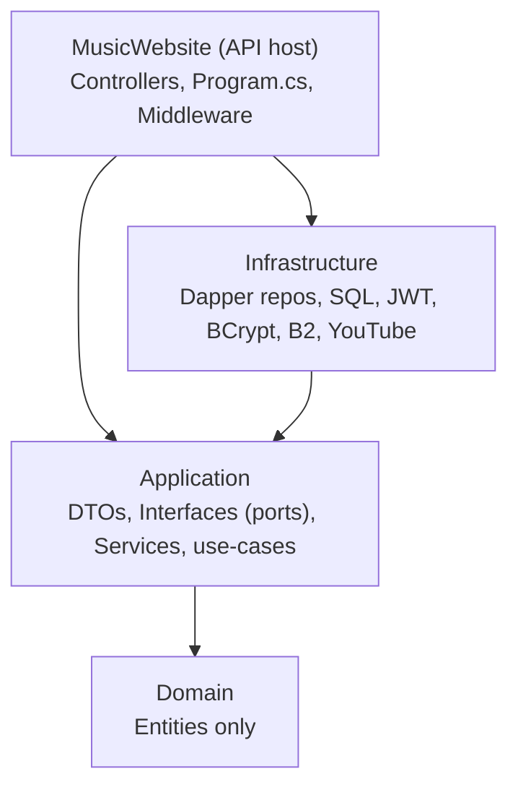
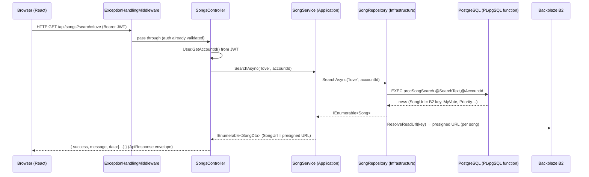
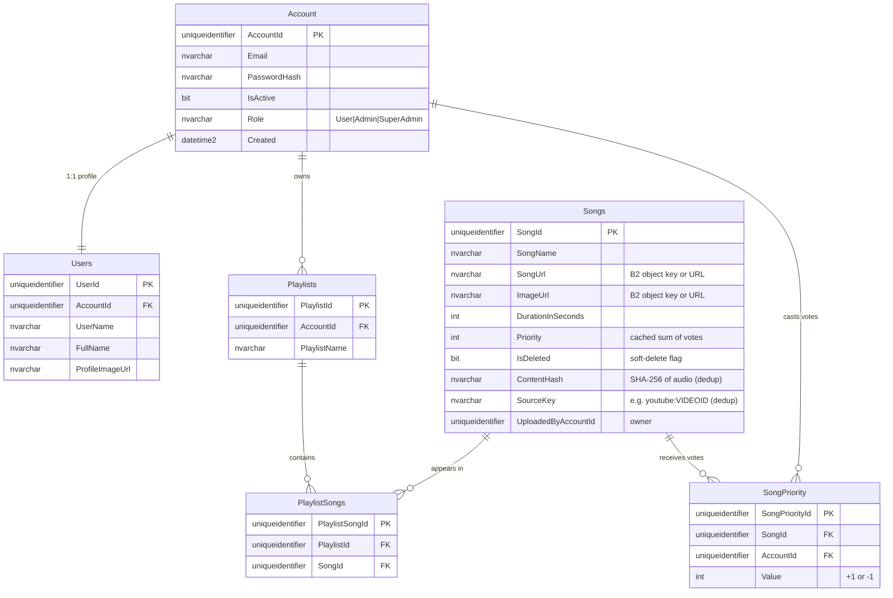
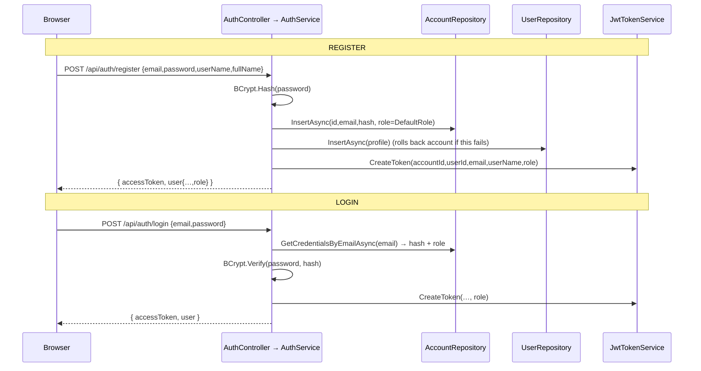
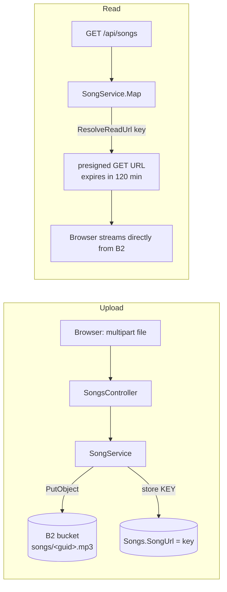
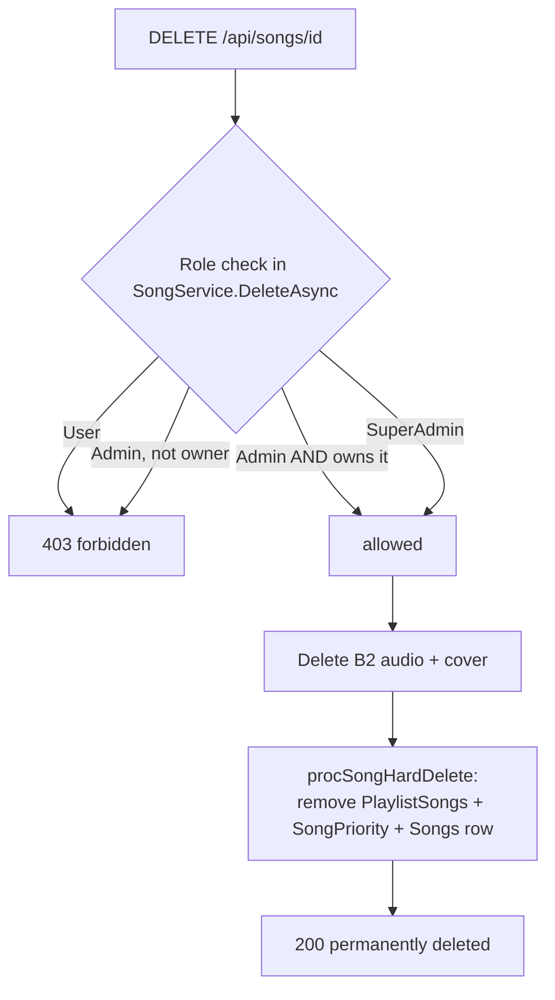

# 📚 Sangeet — Complete Developer Documentation

A single, self-contained guide to the **Sangeet** music-streaming platform. Read this to understand
**what the app does, how the code is structured, how every feature works end-to-end, and how to run,
extend, and deploy it** — without needing to reverse-engineer anything.

> Companion files: `README.md` (quick overview + API reference), `HANDOFF.md` (history + every bug we
> hit and fixed), `HOSTING.md` (exposing the app to the internet). **This file is the deep reference.**

Last updated: 2026-07-24.

---

## Table of contents

1. [What Sangeet is](#1-what-sangeet-is)
2. [Tech stack](#2-tech-stack)
3. [Repository layout](#3-repository-layout)
4. [Architecture — Clean Architecture](#4-architecture--clean-architecture)
5. [How a request flows (end to end)](#5-how-a-request-flows-end-to-end)
6. [The database](#6-the-database)
7. [Authentication & authorization](#7-authentication--authorization)
8. [File storage (Backblaze B2)](#8-file-storage-backblaze-b2)
9. [Feature deep-dives](#9-feature-deep-dives)
10. [The frontend](#10-the-frontend)
11. [Configuration & secrets](#11-configuration--secrets)
12. [Error handling](#12-error-handling)
13. [Database migrations](#13-database-migrations)
14. [Running, building & deploying](#14-running-building--deploying)
15. [How to add a new feature (recipe)](#15-how-to-add-a-new-feature-recipe)
16. [Full API reference](#16-full-api-reference)
17. [Gotchas & FAQs](#17-gotchas--faqs)
18. [Glossary](#18-glossary)

---

## 1. What Sangeet is

Sangeet is a web app where people **register, upload or import music, build playlists, and stream
audio**, with a community up/down **voting** system that ranks songs, and **role-based** control over
who can delete what.

**Core user journeys**

- Register / log in (JWT auth).
- Browse the global song library (ranked by community votes), search by name.
- Add music two ways: **upload an MP3** or **paste a YouTube link** (audio is extracted server-side).
- **Vote** songs up/down — higher-voted songs rank first in Home/Search.
- Create playlists, add/remove songs.
- Play audio in a persistent player (queue, shuffle, repeat, seek, volume).
- **Delete** songs (role-gated) — removes them from cloud storage too.
- **SuperAdmin** console: manage users, roles, and any user's data.

Installable as a **PWA** (works like a native app on phone/desktop).

---

## 2. Tech stack

| Layer | Technology |
|-------|-----------|
| Backend | **ASP.NET 8 Web API** (C#) |
| Architecture | **Clean Architecture** (4 projects) |
| Data access | **Dapper** calling **PL/pgSQL functions** (Npgsql) |
| Database | **PostgreSQL 17 on Supabase** (project `<project-ref>`, region `ap-southeast-1`) |
| Auth | **JWT** access tokens + **BCrypt** password hashing + role claims |
| File storage | **Backblaze B2** (S3-compatible API via `AWSSDK.S3`), private bucket + presigned URLs |
| YouTube extraction | **YoutubeExplode** (pure .NET, no `yt-dlp`/`ffmpeg`) |
| API docs | Swagger / Swashbuckle 6.6.2 |
| Frontend | **React 18 + TypeScript + Vite**, React Router, Axios, lucide-react icons |
| PWA | `vite-plugin-pwa` (installable, offline app shell) |

---

## 3. Repository layout

```
Music Website/                         ← git repo root
├── README.md                          ← overview + API reference
├── DOCUMENTATION.md                   ← THIS FILE (deep developer guide)
├── HANDOFF.md                         ← history + gotchas ("why + bugs we fixed")
├── HOSTING.md                         ← how to expose the app online
├── serve-all.ps1                      ← start BOTH apps, each in its own window/port
├── start-backend.ps1                  ← start only the API   (port from its .env)
├── start-frontend.ps1                 ← start only the frontend (-Prod = build + preview)
├── .gitignore                         ← ignores appsettings.json, .env, bin/obj, node_modules, wwwroot…
│
├── db/postgres/                       ← CURRENT database: PostgreSQL schema + 32 functions + port notes
├── tools/DbMigrator/                  ← one-shot SQL Server ➜ PostgreSQL copy tool
├── db/                                ← historical SQL Server migration scripts (superseded)
│   ├── 2026-07-24_dedup_and_voting.sql
│   └── 2026-07-24c_roles_and_hard_delete.sql
│
├── MusicWebsite/                      ← BACKEND solution
│   ├── MusicWebsite.sln
│   ├── MusicWebsite.Domain/           ← entities only (zero dependencies)
│   ├── MusicWebsite.Application/      ← DTOs, interfaces (ports), services, use-cases
│   ├── MusicWebsite.Infrastructure/   ← Dapper repos, SQL, JWT, BCrypt, B2, YouTube
│   └── MusicWebsite/                  ← Web API host (controllers, Program.cs, appsettings, wwwroot)
│
└── MusicWebsiteFrontEnd/              ← FRONTEND (Vite React TS PWA)
    ├── src/  (api, context, components, pages, types, utils)
    ├── .env / .env.production
    └── index.html
```

---

## 4. Architecture — Clean Architecture

The backend is split into **four projects**, and dependencies point **inward only**. Inner layers
know nothing about outer layers.



**The dependency rule:** `Api → Infrastructure → Application → Domain`. Concretely:

- **Domain** (`MusicWebsite.Domain`) — plain C# entities (`Account`, `User`, `Song`, `Playlist`,
  `PlaylistSong`). No references to anything.
- **Application** (`MusicWebsite.Application`) — the "what". Defines **DTOs**, **interfaces (ports)**
  for everything it needs (repositories, storage, tokens, YouTube), and **services** (the use-cases:
  `AuthService`, `SongService`, `PlaylistService`, `AdminService`, …). Depends only on Domain.
- **Infrastructure** (`MusicWebsite.Infrastructure`) — the "how". Implements the Application ports:
  Dapper repositories, `PostgresErrorTranslator`, `JwtTokenService`, `BcryptPasswordHasher`,
  `BackblazeB2StorageService`, `YoutubeExplodeAudioExtractor`. Depends on Application.
- **API host** (`MusicWebsite`) — controllers, middleware, `Program.cs` (composition root: wires DI,
  JWT, CORS, Swagger, pipeline). Depends on Application + Infrastructure.

**Why this matters:** you can swap the database, or B2 for Azure Blob, by writing a new
Infrastructure implementation — no Application/Domain code changes. Business rules never touch
Dapper, HTTP, or the file system directly. This paid off in the 2026-07-29 SQL Server ➜ PostgreSQL
migration: only Infrastructure changed, and not a single Application, Domain or Controller file.

### Ports & adapters at a glance

| Port (Application interface) | Adapter (Infrastructure impl) |
|------------------------------|-------------------------------|
| `I*Repository` (Persistence) | `*Repository` (Dapper + PL/pgSQL functions) |
| `IPasswordHasher` | `BcryptPasswordHasher` |
| `ITokenService` | `JwtTokenService` |
| `IStorageService` | `BackblazeB2StorageService` (or `StubStorageService`) |
| `IYoutubeAudioExtractor` | `YoutubeExplodeAudioExtractor` |
| `IRoleDefaults` | `RoleDefaults` (reads config) |

---

## 5. How a request flows (end to end)

Example: **`GET /api/songs?search=love`** (list songs matching "love").



**Key points every request shares:**

1. **Envelope** — every response is `{ success, message, data }` (`ApiResponse<T>`).
2. **Auth** — every route except `register`/`login` needs `Authorization: Bearer <jwt>`. The JWT
   carries `accountId`, `userId`, `role`.
3. **Controllers are thin** — they read identity from the JWT and delegate to a service.
4. **Services hold the logic** — validation, permissions, orchestration.
5. **Repositories only run database functions** through `RepositoryBase` (which routes database
   errors through `PostgresErrorTranslator`).
6. **Storage keys → URLs** — the DB stores B2 object keys; services convert them to short-lived
   presigned URLs on read.

---

## 6. The database

**PostgreSQL 17 on Supabase** — project `<project-ref>`, region `ap-southeast-1`,
database `postgres`, schema `public`. DDL lives in `db/postgres/01_schema.sql`, the 32 functions in
`db/postgres/02_functions.sql`, and the SQL Server ➜ PostgreSQL port is explained in
`db/postgres/README.md`.

> Connect through the **Session Pooler** (`aws-0-ap-southeast-1.pooler.supabase.com:5432`, username
> `postgres.<project-ref>`). The direct `db.<ref>.supabase.co` host is IPv6-only.

Identifiers are lower-case in the database (`songid`, `durationinseconds`); the tables below use the
original PascalCase for readability. Dapper's case-insensitive column mapping bridges the two.

### Entity-relationship diagram



### Tables (6)

| Table | Purpose |
|-------|---------|
| `Account` | Login credentials + **Role**. |
| `Users` | Profile, 1:1 with Account. |
| `Songs` | **Global** song library (name, storage keys, duration, priority, owner, dedup keys). |
| `Playlists` | Per-account playlists. |
| `PlaylistSongs` | Many-to-many join (playlist ↔ song). |
| `SongPriority` | The **vote collection** — one row per (Song, Account), `UNIQUE(SongId, AccountId)`. |

### Stored procedures (31)

All GUIDs are generated in **C#** and passed in. Procs use `SET NOCOUNT ON`, `XACT_ABORT`,
transactions, and `THROW` with codes **50001–50044** (plus a few added later). Insert/Update procs
return the affected row; Delete/Remove procs return `Success` + `Message`.

- **Account:** `procAccountInsert` (+`@Role`), `procAccountUpdate`, `procAccountDelete`,
  `procAccountGetById` (+Role), `procAccountLogin` (+Role), `procAccountGetAllWithRole`,
  `procAccountSetRole`, `procAccountCascadeDelete`
- **Users:** `procUserInsert`, `procUserUpdate`, `procUserGetById` (+Role), `procUserGetByAccountId`
  (+Role), `procUserGetByUserName`, `procUserGetAll`
- **Songs:** `procSongInsert` (+ContentHash/SourceKey/UploadedByAccountId), `procSongUpdate`,
  `procSongDelete` (soft), `procSongHardDelete` (permanent), `procSongGetById`, `procSongGetAll`,
  `procSongSearch`, `procSongFindDuplicate`, `procSongVoteSet`
- **Playlists:** `procPlaylistInsert`, `procPlaylistUpdate`, `procPlaylistDelete`,
  `procPlaylistGetById`, `procPlaylistGetByAccountId`
- **PlaylistSongs:** `procPlaylistSongAdd`, `procPlaylistSongRemove`, `procPlaylistSongGetByPlaylistId`

### Data-access conventions

- **Every** DB call goes through a repository method → a PL/pgSQL function → `RepositoryBase`
  (`QueryFirstAsync` / `QuerySingleOrDefaultAsync` / `QueryAsync`).
- Function names live as constants in `Infrastructure/Persistence/StoredProcedures.cs` (typo-proof).
- `RepositoryBase` generates `SELECT * FROM fn(p_x => @X, …)` from the parameter object, so **every
  function parameter must be named `p_` + the lower-cased C# property name**.
- Dapper maps result columns to entity/DTO properties **by name and case-insensitively**, so the
  lower-case PostgreSQL columns fill the PascalCase properties; an extra column (e.g. `myvote`) just
  fills that property, and a missing one leaves the default.
- Business errors are raised as custom SQLSTATEs (`RAISE EXCEPTION … USING ERRCODE = '50001'`) and
  translated to HTTP status by `PostgresErrorTranslator` (see [§12](#12-error-handling)).

---

## 7. Authentication & authorization

### Registration & login flow



- Passwords are hashed with **BCrypt** (`BcryptPasswordHasher`). The hash is stored; `procAccountLogin`
  returns it and **verification happens in C#**, never in SQL.
- Login returns the same generic "Invalid email or password" whether the email is missing or the
  password is wrong (no account enumeration).

### The JWT

`JwtTokenService.CreateToken` emits these claims:

| Claim | Meaning |
|-------|---------|
| `sub`, `jti` | standard subject / token id |
| `accountId` | the Account GUID |
| `userId` | the User (profile) GUID |
| `email`, `userName` | convenience |
| `role` | `User` \| `Admin` \| `SuperAdmin` |

The token is signed with `Jwt:Key` (HMAC-SHA256) and validated in `Program.cs`. **Two critical
settings there:**

- `RoleClaimType = "role"` — so `[Authorize(Roles = "SuperAdmin")]` reads our `role` claim.
- `MapInboundClaims = false` — **required.** Otherwise ASP.NET remaps the short `role` claim to a long
  URI and `[Authorize(Roles=…)]` silently returns 403. (See HANDOFF §5.9.)

Controllers read identity via `ClaimsPrincipalExtensions`: `User.GetAccountId()`, `User.GetUserId()`,
`User.GetRole()`.

### Roles & permissions

| Role | Permissions |
|------|-------------|
| **User** | Listen, search, build playlists, vote. **Cannot delete songs.** |
| **Admin** | Everything a User can + **upload/import + delete songs they uploaded**. |
| **SuperAdmin** | Delete **any** song, delete **any** account, change roles, view any user's playlists. |

- **Default role for new sign-ups** comes from `Roles:DefaultRole` in `appsettings.json` (default
  `"Admin"`; `"User"` also valid). Read by `RoleDefaults` (implements `IRoleDefaults`). Anything else
  (including `"SuperAdmin"`) falls back to `Admin` — **SuperAdmin is never granted through the app.**
- **Granting SuperAdmin** is a manual DB action, then the user must log in again (role is baked into
  the JWT at login time):
  ```sql
  UPDATE Account SET Role='SuperAdmin' WHERE Email='you@example.com';
  ```
- Permission checks live in **services** (e.g. `SongService.DeleteAsync` checks role + ownership) and
  on **controllers** (`[Authorize(Roles = Roles.SuperAdmin)]` on `AdminController`).

---

## 8. File storage (Backblaze B2)

Audio files and cover images live in a **private** Backblaze B2 bucket (`sangeet-audio`), accessed
through B2's **S3-compatible API** with `AWSSDK.S3`.



- **The DB stores the object key** (e.g. `songs/ab12….mp3`), **not** a full URL.
- On every read, `BackblazeB2StorageService.ResolveReadUrl(key)` generates a **presigned GET URL**
  (expiry = `Storage:B2:PresignExpiryMinutes`, default 120). The browser streams straight from B2, so
  the bucket stays private and the server isn't a bandwidth bottleneck.
- Values that are already full `http(s)://…` URLs are passed through unchanged (backward-compatible
  with the "paste a URL" path).
- **`IStorageService`** abstracts this: `UploadAsync`, `DeleteAsync`, `ResolveReadUrl`. If B2 isn't
  configured, `StubStorageService` is registered instead (upload throws 501, URLs pass through).
- **Does the server store files?** No permanent copy. Uploads stream to B2; ASP.NET may briefly spool
  a large incoming file to a temp file during the request, then deletes it. YouTube import downloads
  the audio-only track to a temp file, uploads it, then deletes it (`IAsyncDisposable`). Nothing
  accumulates.

---

## 9. Feature deep-dives

Each feature below lists **the flow** and **the files involved**, so you can jump straight to the code.

### 9.1 Songs: list / search / get

- **Endpoints:** `GET /api/songs?search=`, `GET /api/songs/{id}`.
- **Ranking:** `procSongGetAll` / `procSongSearch` `ORDER BY Priority DESC, SongName` — highest
  community score first. They also `LEFT JOIN SongPriority` for the caller's `MyVote` and return
  `UploadedByAccountId`.
- **Files:** `SongsController` → `SongService` (`GetAllAsync`/`SearchAsync`/`GetByIdAsync`, all take an
  optional `accountId`) → `SongRepository` → procs. `SongService.Map` turns storage keys into
  presigned URLs.

### 9.2 Upload an MP3 (with duplicate prevention)

```mermaid
sequenceDiagram
    participant C as Upload page
    participant Ctrl as SongsController
    participant Svc as SongService
    participant Repo as SongRepository
    participant B2 as Backblaze B2

    C->>Ctrl: POST /api/songs/upload (multipart: audioFile, coverImage?, songName)
    Ctrl->>Svc: UploadAsync(meta, audio, cover, uploadedBy=accountId)
    Svc->>Svc: SHA-256 hash of audio bytes (HashAndRewindAsync)
    Svc->>Repo: FindDuplicateAsync(hash, null)
    alt duplicate exists
        Repo-->>Svc: existing song
        Svc-->>Ctrl: throw 409 "already in the library"
    else new
        Svc->>B2: UploadAsync(audio) → key ; UploadAsync(cover) → key
        Svc->>Repo: InsertAsync(…, contentHash, uploadedBy)
        Repo-->>Svc: song
        Svc-->>Ctrl: SongDto (201)
    end
```

- **Dedup by content, not name** — the SHA-256 is checked **before** the B2 upload, so a re-uploaded
  identical file never wastes storage. Enforced by unique filtered index `UX_Songs_ContentHash`.
- Allowed audio: `.mp3/.m4a/.aac/.wav/.ogg/.flac`; covers: `.jpg/.jpeg/.png/.webp/.gif`; max 100 MB.
- If the DB insert fails after upload, the uploaded blobs are deleted (no orphans).
- **Files:** `SongsController.Upload` → `SongService.UploadAsync` (+`HashAndRewindAsync`) →
  `SongRepository.InsertAsync` / `FindDuplicateAsync` → `procSongInsert` / `procSongFindDuplicate`.

### 9.3 Import from a YouTube link

- **Endpoints:** `POST /api/songs/youtube/preview` (metadata only, fast) and `POST /api/songs/youtube`
  (full import).
- **Two interchangeable extractors** behind `IYoutubeAudioExtractor`, chosen by `Youtube:Provider`:
  - **`YtDlpAudioExtractor` (default, recommended)** — shells out to **`yt-dlp.exe`**, the
    industry-standard downloader. Far more reliable: it imports videos the pure-.NET scraper can't,
    and its maintainers keep it working as YouTube changes. Downloads the best audio-only stream
    (usually `.m4a`, so **no ffmpeg needed**) into a temp folder, plus the thumbnail, then uploads to B2.
  - **`YoutubeExplodeAudioExtractor`** — pure-.NET fallback (no binaries), but only works on a subset
    of videos and breaks more often. Kept as a no-install option.
- **Config** (`Youtube` section): `Provider` (`"YtDlp"`/`"YoutubeExplode"`), `YtDlpPath` (full path to
  `yt-dlp.exe`), `TimeoutSeconds`.
- **Dedup by video id** — the canonical video id is parsed **locally** and stored as
  `SourceKey = "youtube:<id>"`. If already imported, the existing song is returned and the whole
  download+upload is skipped (unique index `UX_Songs_SourceKey`).
- **Requires the server to reach youtube.com** — corporate networks often block it (HTTP 502).
- **Keeping yt-dlp current:** if imports start failing after a YouTube change, update the binary
  (`yt-dlp.exe -U`, or re-download the latest release). yt-dlp also warns that a JS runtime (deno)
  improves reliability for a few videos — optional; it works without one for the vast majority.
- **Files:** `SongsController` → `SongService` (`GetYoutubePreviewAsync`, `ImportFromYoutubeAsync`) →
  `IYoutubeAudioExtractor` → `YtDlpAudioExtractor` / `YoutubeExplodeAudioExtractor`.

### 9.4 Priority — community up/down voting

- **Design:** `Songs.Priority` is a **cached sum of votes**, not a manual field. Each user casts one
  vote (+1/−1) per song; re-tapping clears it. Search ranks by `Priority DESC`.
- **`SongPriority`** table holds the votes with `UNIQUE(SongId, AccountId)` — that constraint enforces
  "one value per user per song".
- **`procSongVoteSet`** upserts the user's vote and recomputes `Songs.Priority = SUM(Value)` in one
  transaction, returning the song with its new total + the caller's `MyVote`.
- **Endpoint:** `POST /api/songs/{id}/vote` body `{ value: 1 | -1 | 0 }`.
- **Frontend:** `VoteControl` component on Home cards + Search rows (optimistic UI, reverts on error).
- **Files:** `SongsController.Vote` → `SongService.SetVoteAsync` → `SongRepository.SetVoteAsync` →
  `procSongVoteSet`.

### 9.5 Playlists

- **Endpoints:** `GET/POST /api/playlists`, `GET/PUT/DELETE /api/playlists/{id}`,
  `GET /api/playlists/{id}/songs`, `POST/DELETE /api/playlists/{id}/songs/{songId}`.
- **Ownership:** playlist routes enforce ownership (a non-owner gets 404). Removing a song from a
  playlist only deletes the **association** (`PlaylistSongs` row) — the song itself is untouched.
- **Files:** `PlaylistsController` → `PlaylistService` → `PlaylistRepository` / `PlaylistSongRepository`.

### 9.6 Delete a song (permanent + cloud cleanup)



- **Permanent** — replaces the old soft-delete. `procSongHardDelete` removes the song row, its
  playlist links, and its votes; the service first deletes the **B2 files** to free cloud space.
- **Permission:** SuperAdmin → any; Admin → only songs they uploaded (`UploadedByAccountId ==
  callerAccountId`); User → never (403).
- **Files:** `SongsController.Delete` → `SongService.DeleteAsync(songId, callerAccountId, callerRole)`
  → `IStorageService.DeleteAsync` + `SongRepository.HardDeleteAsync` → `procSongHardDelete`.
- **Frontend:** `SongDeleteButton` renders only when `canDeleteSong(song, user)` is true; confirms,
  calls the API, and removes the song from the list.

### 9.8 "My Uploads" history (paginated)

- Lets an uploader (Admin/SuperAdmin) see **the songs they added**, newest first, and delete them.
- **Paginated** — 10 per page. `procSongGetByUploader` returns the page **and** a total count (two
  result sets); `RepositoryBase.QueryPageAsync` reads both; the service returns `PagedResult<SongDto>`.
- **Endpoint:** `GET /api/songs/mine?page=1&pageSize=10`.
- **Frontend:** `pages/MyUploads.tsx` (route `/uploads`) — a list with delete buttons and a page index
  bar (‹ 1 2 3 … ›). Deleting the last item on a page steps back a page.
- **Feature flag** `VITE_SHOW_UPLOAD_HISTORY` (`.env`): when `false`, the page + nav link are hidden
  and the app makes **no** `/api/songs/mine` calls — a cheap way to cut DB load once the library is
  large. Read in `src/config.ts`.

### 9.7 SuperAdmin console

- **Endpoints (`AdminController`, `[Authorize(Roles = SuperAdmin)]`):**
  - `GET /api/admin/users` — every account with role + profile.
  - `PUT /api/admin/users/{accountId}/role` — set User/Admin (never SuperAdmin).
  - `DELETE /api/admin/users/{accountId}` — cascade-delete an account + all its data.
  - `GET /api/admin/users/{accountId}/playlists` — view any user's playlists.
- **Guardrails** (in `AdminService`): you can't change/delete **yourself** or another **SuperAdmin**
  via the API.
- **Files:** `AdminController` → `AdminService` → `AccountRepository`
  (`GetAllWithRoleAsync`/`SetRoleAsync`/`CascadeDeleteAsync`) + `PlaylistRepository`.
- **Frontend:** `pages/Admin.tsx` (route `/admin`, link shown only to SuperAdmins).

---

## 10. The frontend

React 18 + TypeScript + Vite, in `MusicWebsiteFrontEnd/`.

### Structure

```
src/
├── api/
│   ├── client.ts        ← axios instance: JWT interceptor, unwraps { success,message,data },
│   │                       401 → clears token & bounces to /login
│   └── endpoints.ts     ← typed API functions: authApi, userApi, songApi, playlistApi, adminApi
├── context/
│   ├── AuthContext      ← current user (+role), login/register/logout, session restore via /me
│   ├── PlayerContext    ← single <audio>, queue, shuffle/repeat/seek/volume, refreshes expired URLs
│   ├── LibraryContext   ← playlists + "add to playlist" modal
│   └── ToastContext     ← toast notifications
├── components/
│   ├── layout/          ← Sidebar, TopBar, MobileTopBar, MobileNav, Layout
│   ├── player/PlayerBar ← desktop full player + mobile mini-player + seek bar
│   ├── song/            ← SongCard, SongRow, VoteControl, SongDeleteButton
│   └── ui/              ← Cover, Avatar, Modal
├── pages/               ← Login, Register, Home, Search, Library, PlaylistDetail, Upload,
│                           Profile, Admin
├── types/index.ts       ← API DTO types (User, Song, Playlist, AdminUser, Role…)
├── utils/format.ts      ← duration formatting, etc.
├── App.tsx              ← routes (ProtectedRoute wraps the app shell)
└── index.css            ← the whole design system (dark theme, responsive, PWA)
```

### How the frontend talks to the backend

- `client.ts` creates an axios instance with `baseURL = VITE_API_URL` — the API's absolute address,
  since the API is a separate app on its own port (empty only in single-origin mode →
  same-origin). A request interceptor attaches `Authorization: Bearer <token>`; a response interceptor
  unwraps the envelope and, on 401, clears the token and redirects to `/login`.
- `endpoints.ts` groups all calls by domain (`songApi.upload`, `songApi.vote`, `adminApi.setRole`, …)
  and returns typed data via `unwrap<T>`.

### State via React Context

- **AuthContext** — holds the logged-in `user` (including `role`). On load it restores the session by
  calling `GET /api/users/me` with the stored token. `login`/`register` store the JWT and set the user.
- **PlayerContext** — owns a single `<audio>` element and all playback state (current track, queue,
  isPlaying, shuffle, repeat off/all/one, seek, volume). It **auto-refreshes expired presigned URLs**
  by re-fetching the song when playback errors.
- **LibraryContext** — playlists + the "add to playlist" modal, reachable from any song.
- **ToastContext** — `push(message, 'success'|'error')`.

### Routing & guards

`App.tsx` uses React Router. `ProtectedRoute` gates the app shell (redirects to `/login` if not
authenticated). The **Admin** route/link is shown only when `user.role === 'SuperAdmin'`. Song delete
buttons appear only when `canDeleteSong` allows it.

### Responsive & PWA

- Desktop sidebar ↔ mobile bottom-nav; the player collapses to a compact mini-player with a full-width
  seek bar on phones. The whole app-shell prevents horizontal overflow.
- `vite-plugin-pwa` makes it installable with an offline app shell and auto-updating service worker.
- **Heads-up:** because of the service worker, after deploying a new build you may need a hard refresh
  (or to unregister the SW) to see changes on `:5000`.

---

## 11. Configuration & secrets

All backend config is in **`MusicWebsite/MusicWebsite/appsettings.json`**, which is **gitignored**
(so secrets never reach GitHub). A committed **`appsettings.example.json`** documents the structure.

| Section | Keys | Notes |
|---------|------|-------|
| `ConnectionStrings:MusicDatabase` | PostgreSQL/Supabase connection | `postgresql://` URI or Npgsql key=value. Use the Session Pooler host on IPv4 networks. |
| `Jwt` | `Issuer`, `Audience`, `Key`, `AccessTokenMinutes` | **`Key` must be a long random secret.** |
| `Cors:AllowedOrigins` | array | Plus a predicate allows any localhost / private-LAN origin. |
| `Roles:DefaultRole` | `"Admin"` \| `"User"` | Role for new sign-ups. **SuperAdmin is DB-only.** |
| `Youtube:Provider` | `"YtDlp"` \| `"YoutubeExplode"` | Which extractor. `YtDlp` (robust) needs `yt-dlp.exe`. |
| `Youtube:YtDlpPath` | full path | Location of `yt-dlp.exe` (download from the yt-dlp GitHub releases). |
| `Storage:Provider` | `"BackblazeB2"` or other | Other → `StubStorageService`. |
| `Storage:B2` | `ServiceUrl, Region, BucketName, KeyId, ApplicationKey, PresignExpiryMinutes, MaxUploadMegabytes` | B2 credentials + bucket. |

**Backend runtime config:** `MusicWebsite/MusicWebsite/.env` (read by `Extensions/DotEnv.cs` *before*
`WebApplication.CreateBuilder`, so the values arrive through `IConfiguration` like any other setting;
a real environment variable of the same name always wins).

| Key | Default | Meaning |
|-----|---------|---------|
| `BACKEND_HOST` | `0.0.0.0` | Interface to bind. `0.0.0.0` = localhost + LAN; `127.0.0.1` = this PC only. |
| `BACKEND_PORT` | `5000` | Port the API listens on. Change + restart, no rebuild. |
| `FRONTEND_ORIGINS` | `http://localhost:5173,http://localhost:4173` | Comma-separated CORS allow-list, merged with `Cors:AllowedOrigins` from appsettings. localhost/private-LAN on any port is allowed automatically. |
| `SERVE_FRONTEND` | `false` | `true` = also serve the built frontend from `wwwroot` on this port. |
| `ASPNETCORE_ENVIRONMENT` | `Development` | `Development` also enables Swagger at `/swagger`. |

An explicit `ASPNETCORE_URLS` (IIS, Azure, VS "https" launch profile) takes precedence over
`BACKEND_HOST`/`BACKEND_PORT`.

**Frontend config:** `MusicWebsiteFrontEnd/.env` (dev) and `.env.production` (build)
- `VITE_PORT` — port for `npm run dev` (default 5173). `VITE_PREVIEW_PORT` — port for
  `npm run preview` (default 4173). Both are read in `vite.config.ts` via `loadEnv`, with
  `strictPort` so a busy port fails loudly instead of silently moving.
- `VITE_API_URL` — absolute base URL of the API, as the **browser** must reach it (e.g.
  `http://192.168.1.36:5000`). Leave it empty **only** for the single-origin mode where the backend
  serves the build (`SERVE_FRONTEND=true`). ⚠️ Baked in at build time — rebuild after changing.
- `VITE_SHOW_UPLOAD_HISTORY` — `true`/`false`. When `false`, the "My Uploads" page + nav link are
  hidden and the app never calls `/api/songs/mine` (saves DB queries at scale). Read in `src/config.ts`.

**On deploy:** `.env` files are gitignored (per-machine); `.env.example` is the committed template,
and the backend `.env` is copied next to the published exe. Since `appsettings.json` also isn't in
source control, either copy it onto the host or supply values as environment variables
(e.g. `Storage__B2__ApplicationKey=…`, which override the file).

---

## 12. Error handling

Two mechanisms produce the consistent `{ success, message, data }` envelope even on failure:

1. **`AppException(message, statusCode)`** — thrown by services for expected business failures
   (validation, permission, not-found). `ExceptionHandlingMiddleware` catches it and writes the
   carried status + message. Anything else becomes a logged **500** "An unexpected error occurred."
2. **`SqlErrorTranslator`** — stored procedures `THROW` codes ≥ 50000; the translator maps them to
   HTTP status and wraps them as `AppException`:
   - **409** — uniqueness (email/username/playlist/song already exists)
   - **404** — not found (account/user/song/playlist)
   - **400** — validation / bad reference
   - Auth failures → **401**; unknown ≥50000 → 400; non-business SQL errors → bubble up as 500.

So a controller/service just throws or lets a proc throw, and the client always gets a clean JSON
error with the right status code.

---

## 13. Database migrations

Schema changes are captured as **idempotent SQL scripts** in `db/`, applied in filename order:

| Script | Adds |
|--------|------|
| `2026-07-24_dedup_and_voting.sql` | `Songs.ContentHash` + `SourceKey` (+ unique filtered indexes), `SongPriority` table, `procSongFindDuplicate` / `procSongVoteSet`, `@AccountId` + `MyVote` on song reads, rank `Priority DESC`. |
| `2026-07-24c_roles_and_hard_delete.sql` | `Account.Role`, `Songs.UploadedByAccountId`, role in login/profile projections, `procSongHardDelete`, `procAccountGetAllWithRole` / `procAccountSetRole` / `procAccountCascadeDelete`. |

**Run a migration** (note the **`-I`** flag — required because `Songs` has filtered indexes):

```bash
sqlcmd -S "BC-MANJEETSINGH\SQL25" -E -d MusicDatabase -I -b -i "db/<file>.sql"
```

> ⚠️ Without `-I` (QUOTED_IDENTIFIER ON), any DDL/DML on `Songs` fails with error 1934. The running
> app is fine — `Microsoft.Data.SqlClient` sets QUOTED_IDENTIFIER ON by default.

---

## 14. Running, building & deploying

### Prerequisites
.NET 8 SDK, Node.js, network access to the SQL Server, a `appsettings.json` with real secrets.

### Backend (dev)
```bash
cd "MusicWebsite"
dotnet build MusicWebsite.sln
dotnet run --project MusicWebsite/MusicWebsite.csproj      # → http://localhost:5000
# Swagger (Development only): http://localhost:5000/swagger
```

### Frontend (dev)
```bash
cd "MusicWebsiteFrontEnd"
npm install        # first time
npm run dev        # → http://localhost:5173  (hot reload)
```

### Run both (separate ports — the normal setup)
```powershell
./serve-all.ps1            # dev:  API :5000 + Vite dev server :5173, each in its own window
./serve-all.ps1 -Prod      # prod: API :5000 + built frontend served on :4173
./start-backend.ps1        # API only
./start-frontend.ps1       # frontend only  (-Prod = build + preview)
```
Ports are **not hard-coded**: the API reads `BACKEND_HOST`/`BACKEND_PORT` from
`MusicWebsite/MusicWebsite/.env`, Vite reads `VITE_PORT`/`VITE_PREVIEW_PORT` from
`MusicWebsiteFrontEnd/.env`. The two are linked by `VITE_API_URL` (frontend → API address) and
`FRONTEND_ORIGINS` (backend → CORS allow-list). Because they are separate apps, each can be
deployed to a **different server** — see `HOSTING.md`.

### Single-origin fallback (one port, easiest to expose)
Set `SERVE_FRONTEND=true` in the backend `.env`, build the frontend with an empty `VITE_API_URL`,
and copy `MusicWebsiteFrontEnd/dist/*` into `MusicWebsite/MusicWebsite/wwwroot`. The backend then
serves the React app via `UseStaticFiles()` + `MapFallbackToFile("index.html")` — one port, no CORS,
and only that one port needs a tunnel.

### Order-of-operations rules
- **Stop the backend before rebuilding** (it locks `MusicWebsite.exe`).
- Only run **one** backend at a time (port 5000). Kill a stray one:
  `taskkill /F /IM MusicWebsite.exe` (or `dotnet.exe`).

---

## 15. How to add a new feature (recipe)

Say you want to add "favorite a song". Touch the layers **inward → outward**:

1. **Database** — write a migration in `db/`: a table/column and stored proc(s). Run it with `-I`.
2. **Domain** — add/extend an entity in `MusicWebsite.Domain` if needed.
3. **Application**
   - Add a DTO in `DTOs/`.
   - Add a method to the relevant **repository interface** (`Interfaces/Persistence`) and **service
     interface** (`Interfaces/Services`).
   - Implement the method in the **service** (business rules, permissions).
4. **Infrastructure**
   - Add the proc name to `StoredProcedures.cs`.
   - Implement the repository method (Dapper call).
   - Register any new service/adapter in `DependencyInjection.cs`.
5. **API** — add a controller action; read identity via `User.GetAccountId()` / `GetRole()`; return
   `ApiResponse<T>.Ok(...)`.
6. **Frontend** — add a typed function in `endpoints.ts`, a type in `types/`, and wire the UI
   (component/page/context). Build and deploy.

**Golden rules:** controllers stay thin; only Infrastructure touches Dapper/SQL/HTTP-clients; all DB
access goes through a stored procedure + `RepositoryBase`; GUIDs are generated in C#; business errors
are `AppException(message, status)`.

---

## 16. Full API reference

Base URL `http://localhost:5000`. Envelope `{ success, message, data }`. All routes except
register/login require `Authorization: Bearer <token>`.

### Auth — `/api/auth`
| Method | Route | Body | Notes |
|--------|-------|------|-------|
| POST | `/register` | `{ email, password, userName, fullName, profileImageUrl? }` | Creates Account+User, returns JWT. 409 if taken. Role = configured default. |
| POST | `/login` | `{ email, password }` | Returns JWT + profile (incl. role). 401 if invalid. |
| POST | `/logout` | — | Stateless (client discards token). |

### Users — `/api/users`
| Method | Route | Notes |
|--------|-------|-------|
| GET | `/me` | Current user's profile (incl. role). |
| PUT | `/me` | `{ userName, fullName, profileImageUrl? }`. 409 if username taken. |
| GET | `/` | All users. |
| GET | `/{userId}` | User by id. |

### Account — `/api/account`
| Method | Route | Notes |
|--------|-------|-------|
| GET | `/` | Own account (email, status). |
| PUT | `/` | `{ email, isActive }`. |
| DELETE | `/` | Delete own account. |

### Songs — `/api/songs`
| Method | Route | Notes |
|--------|-------|-------|
| GET | `/?search=term` | List all / filter by name. Ranked by priority. `songUrl`/`imageUrl` are presigned. |
| GET | `/{id}` | Song by id. |
| GET | `/mine?page=&pageSize=` | Paginated list of songs the current user uploaded (10/page). |
| POST | `/` | JSON `{ songName, songUrl, imageUrl?, durationInSeconds?, priority? }` — create from a URL. |
| POST | `/upload` | multipart: `audioFile`, `coverImage?`, `songName`, … → uploads to B2. 409 if duplicate file. Max 100 MB. |
| POST | `/youtube/preview` | `{ url }` → `{ title, author, durationInSeconds, thumbnailUrl }`. Metadata only. |
| POST | `/youtube` | `{ url, songName?, priority? }` → extract audio + thumbnail → B2 → save. 502 if YouTube unreachable. |
| POST | `/{id}/vote` | `{ value: 1 \| -1 \| 0 }` → set the user's single vote; returns new `priority` + `myVote`. |
| PUT | `/{id}` | Update song. |
| DELETE | `/{id}` | **Permanent delete** (DB + cloud). User → 403, Admin → own only, SuperAdmin → any. |

### Playlists — `/api/playlists` (ownership enforced: non-owner → 404)
| Method | Route | Notes |
|--------|-------|-------|
| GET | `/` | Current user's playlists (with `totalSongs`). |
| GET | `/{id}` | Playlist by id. |
| POST | `/` | `{ playlistName }`. 409 if duplicate name. |
| PUT | `/{id}` | `{ playlistName }`. |
| DELETE | `/{id}` | Delete playlist. |
| GET | `/{id}/songs` | Songs in playlist. |
| POST | `/{id}/songs/{songId}` | Add song. 409 if already present. |
| DELETE | `/{id}/songs/{songId}` | Remove song from playlist (association only). |

### Admin — `/api/admin` (SuperAdmin only)
| Method | Route | Notes |
|--------|-------|-------|
| GET | `/users` | All accounts with role + profile. |
| PUT | `/users/{accountId}/role` | `{ role: "User" \| "Admin" }`. Can't target self or a SuperAdmin. |
| DELETE | `/users/{accountId}` | Permanently delete account + its data. Can't target self or a SuperAdmin. |
| GET | `/users/{accountId}/playlists` | View any user's playlists. |

---

## 17. Gotchas & FAQs

- **`[Authorize(Roles=…)]` returns 403 for a valid SuperAdmin** → JWT claim remapping. Keep
  `options.MapInboundClaims = false` in Program.cs. (HANDOFF §5.9)
- **`sqlcmd` fails with "incorrect QUOTED_IDENTIFIER"** → add `-I`. (HANDOFF §5.8)
- **YouTube import returns 502** → the server's network blocks youtube.com (common on office Wi-Fi).
  Works on any network where YouTube is reachable. (HANDOFF §5.7)
- **YouTube import: metadata works but "can't read the audio streams" (player API 400)** → the
  `YoutubeExplode` package is behind YouTube's latest changes. Upgrade it (`dotnet add package
  YoutubeExplode`), rebuild, restart. Expect to repeat occasionally. (HANDOFF §5.10)
- **Frontend changes not showing** → the PWA service worker cache; hard-refresh / unregister the SW.
  In single-origin mode (`SERVE_FRONTEND=true`) it's usually a stale `wwwroot`: rebuild and re-copy
  `dist/*`. In dev, use the dev server on :5173.
- **Changed a port or `VITE_API_URL` and nothing happened** → `VITE_*` values are baked in at build
  time. Restart `npm run dev`, or re-run `npm run build`. For the API, restart it after editing `.env`.
- **CORS error / "Cannot reach the server"** → the frontend origin isn't in the backend's
  `FRONTEND_ORIGINS`, or `VITE_API_URL` points at a port nothing is listening on.
- **"Port 5000 already in use"** → a second backend started. Kill `MusicWebsite.exe`. (HANDOFF §5.3)
- **Page 404 at `http://IP:5000/`** for the API root is normal — open `/swagger` or the SPA route.
- **No HTTPS** — the app runs plain HTTP on 5000 on purpose (LAN/tunnel friendly). Add HTTPS +
  redirection only with a real cert. (HANDOFF §5.1)

---

## 18. Glossary

| Term | Meaning |
|------|---------|
| **Clean Architecture** | Layered design where dependencies point inward; business rules don't depend on frameworks/DB. |
| **Port / Adapter** | An interface defined by Application (port) and implemented by Infrastructure (adapter). |
| **DTO** | Data Transfer Object — the shape sent to/from the API (vs. an internal entity). |
| **Envelope** | The `{ success, message, data }` wrapper on every API response (`ApiResponse<T>`). |
| **Presigned URL** | A time-limited URL that grants read access to a private B2 object without exposing keys. |
| **Object key** | The path of a file in B2 (e.g. `songs/<guid>.m4a`); stored in the DB instead of a URL. |
| **Soft delete** | Marking a row `IsDeleted=1` (kept for history). **Hard delete** removes it permanently. |
| **Content hash** | SHA-256 of an uploaded file, used to reject exact duplicates. |
| **Source key** | External source id (`youtube:<videoId>`) used to import a source only once. |
| **Priority** | A song's cached community score (sum of up/down votes); drives search ranking. |
| **Claim** | A key/value fact inside the JWT (e.g. `role`, `accountId`). |
| **PWA** | Progressive Web App — installable, works offline via a service worker. |

---

*This document reflects the codebase as of 2026-07-24 (features: auth, songs, upload, YouTube import,
duplicate prevention, voting, roles, permanent delete, SuperAdmin console). Keep it updated as the
code evolves.*
